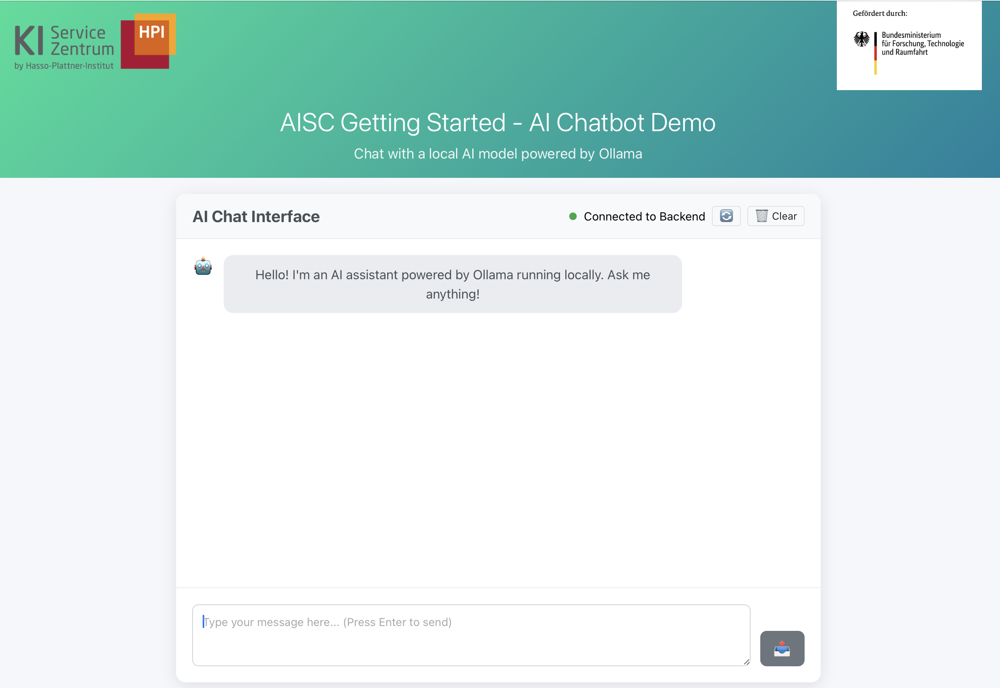

<div style="background-color: #ffffff; color: #000000; padding: 10px;">

<h1>AI for Everybody — Getting Started
</div>

This repository hosts the **Getting Started** workshop offered by the [AI Service Centre Berlin Brandenburg](https://hpi.de/kisz). It introduces the development tools and workflows — VSCode, Git, WSL, Python, UV, Ollama, and Docker — that participants will use across our workshops.

## Workshop materials

All workshop content lives in [`03_workshop/`](03_workshop/). The workshop's own README is the entry point:

**[`03_workshop/README.md`](03_workshop/README.md)**

It contains the agenda, the per-tool guides, the Jupyter notebooks for replay at home, and the slides.

## Example application

This repository also includes a small chatbot application that demonstrates what you can build once your environment is set up:

- [`01_frontend/`](01_frontend/) — React chat interface
- [`02_backend/`](02_backend/) — FastAPI server with Ollama integration
- [`docker-compose.yml`](docker-compose.yml) — runs the full stack locally

The chatbot is the final demo of the workshop (section 8). See [`03_workshop/guides/08_chatbot_demo.md`](03_workshop/guides/08_chatbot_demo.md) for the walkthrough.



## Repository structure

```
workshop-getting-started/
├── README.md                  ← you are here
├── 03_workshop/               main workshop content
│   ├── README.md              workshop entry point: agenda + format
│   ├── guides/                per-tool guides (one per agenda item)
│   ├── notebooks/             Jupyter notebooks for replay at home
│   ├── slides/                workshop slides (English + German)
│   └── _archive/              deprecated pre-May 2026 setup guides
├── 01_frontend/               React chatbot UI (chatbot demo, §8)
├── 02_backend/                FastAPI backend (chatbot demo, §8)
├── docker-compose.yml         orchestration for the chatbot stack
├── run.sh                     one-command launcher for the chatbot
├── 00_aisc/                   AISC branding assets
└── pyproject.toml             Python project config (UV-managed)
```

## Contact

Questions or installation issues: **kisz@hpi.de**

## Authors

- [Hanno Müller](https://github.com/hanno-mueller-HPI)
- [David Goll](https://github.com/golldavid)

## License

This project is licensed under the MIT license — see the LICENSE file for details.

---

## Acknowledgements


The [AI Service Centre Berlin Brandenburg](http://hpi.de/kisz) is funded by the [Federal Ministry of Research, Technology and Space](https://www.bmbf.de/) under the funding code 01IS22092.
